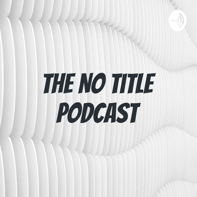

<!DOCTYPE HTML>
<head>
	<title>
		NO TITLE PODCAST
	</title>
</head>

	<h1 style="text-align:center;">THE NO TITLE PODCAST</h1>
	<h2 style="text-align:center;">BY MOHIT SANTOSH</h2>
	
<body>
	<footer>
			<ul>
<li><a href="about.html">ABOUT THE PODCAST</a></li>
<li><a href="podcast.html">LINKS TO PODCAST</a></li>
<li></li>
<li></li>
	</ul>
	</footer>
	</body>
	</html>
